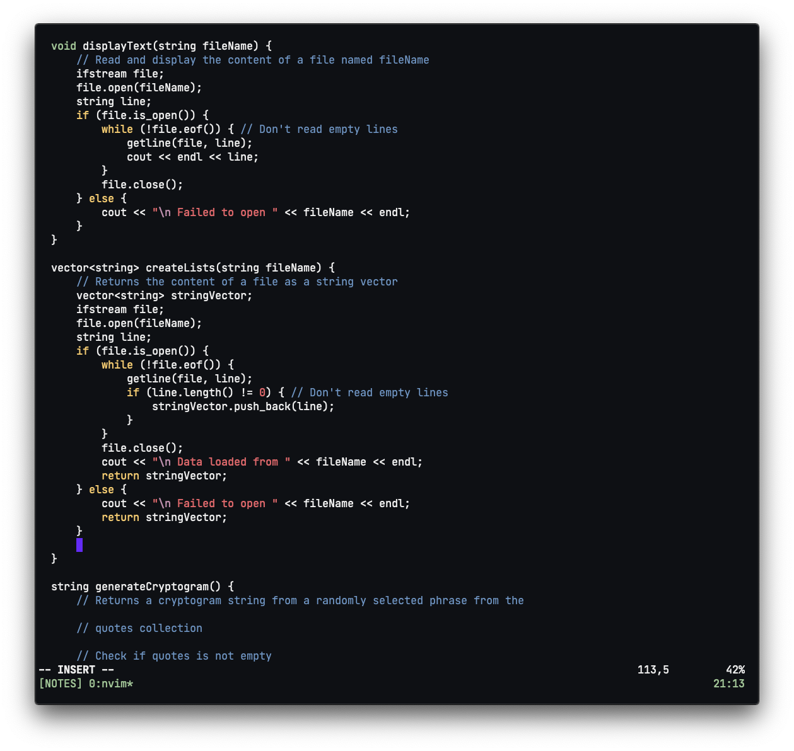

# Configuration



## Mac OS

### Change key repeat variable

```shell
defaults write -g InitialKeyRepeat -int 15  # normal minimum is 15 (225 ms)
defaults write -g KeyRepeat -int 1          # normal minimum is 2 (30 ms)
```

### Homebrew

<https://brew.sh>

```shell
# Install homebrew
/bin/bash -c "\$(curl -fsSL https://raw.githubusercontent.com/Homebrew/install/master/install.sh)"

brew update
brew install fortune
brew install cowsay
brew install git
brew install node
brew install neovim
brew install pngpaste
brew install jp2a

brew cask install iterm2
brew cask install google-chrome
brew cask install visual-studio-code
brew cask install zoomus
brew cask install hyperswitch
brew cask install mos  # Maybe not
```

### iTerm2

- Advanced > Windows > Terminal windows resize smoothly -> Yes
- Profiles > Colors > Color Presets -> p-ocean
- Profiles > Text > Font -> JetBrains Mono
- Profiles > Window > Style -> No Title Bar

### Create symbolic links

```shell
git clone git@github.com:bbriano/dotfiles.git ~/n/dotfiles
mkdir ~/.config/nvim

ln -sf ~/n/dotfiles/vimrc ~/.config/nvim/init.vim
ln -sf ~/n/dotfiles/prettierrc.json ~/.prettierrc
ln -sf ~/n/dotfiles/tmux.conf ~/.tmux.conf
ln -sf ~/n/dotfiles/zshrc ~/.zshrc
```
