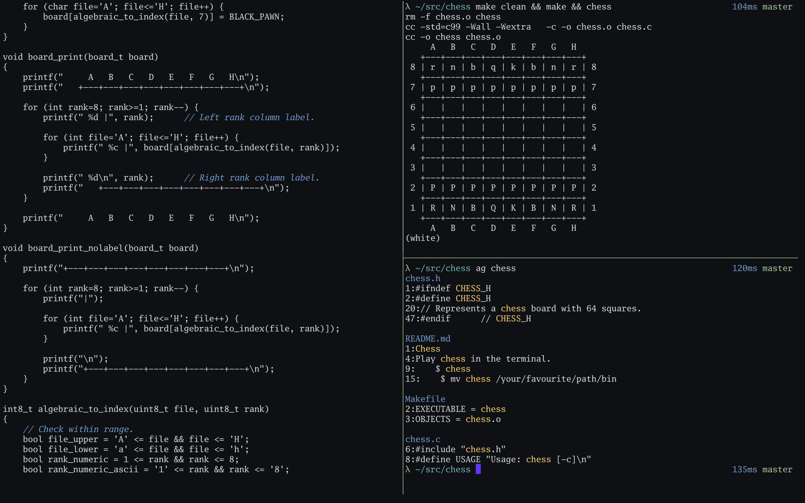

Configuration
=============

Install (MacOS)
---------------

    git clone https://github.com/bbriano/dotfiles
    cd dotfiles
    chmod +x install.sh
    ./install.sh

iTerm2 options
--------------

-   General > Selection > Application in terminal may access clipboard > Yes
-   Appearance > Windows > Hide scrollbars > Yes
-   Profiles > Colors > Color Presets > p-ocean
-   Profiles > Text > Font > Go Mono 14
-   Profiles > Window > Style > No Title Bar
-   Profiles > Terminal > Scrollback lines > 0
-   Profiles > Keys > Left Option key > Esc+
-   Advanced > Windows > Terminal windows resize smoothly > Yes
-   Advanced > Terminal > Prevent accidental drags > Yes
