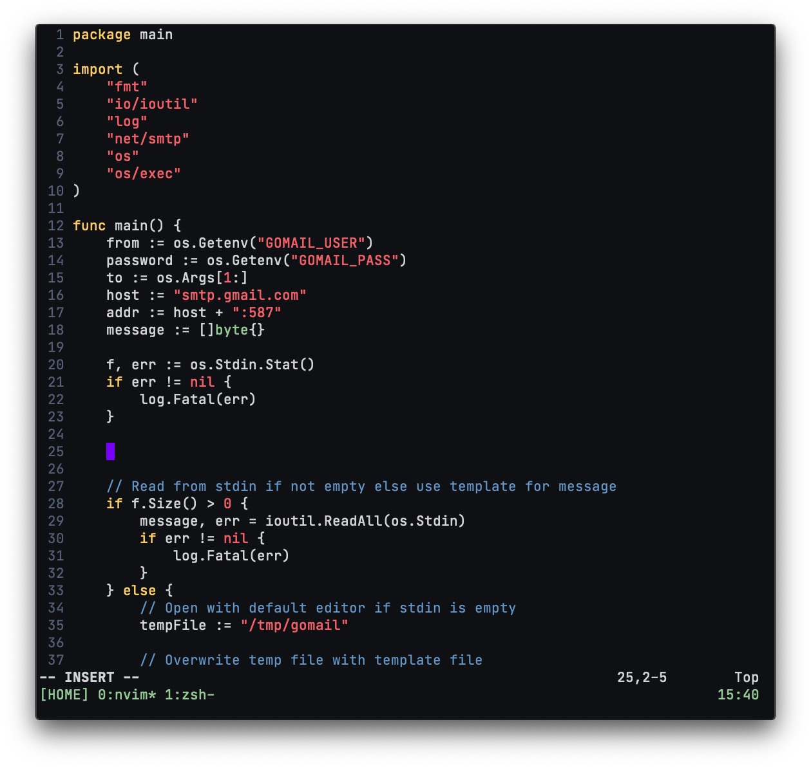

# Configuration



## Mac OS

### Change key repeat variable

```shell
defaults write -g InitialKeyRepeat -int 15  # normal minimum is 15 (225 ms)
defaults write -g KeyRepeat -int 1          # normal minimum is 2 (30 ms)
```

### Homebrew

```shell
# install homebrew
/bin/bash -c "\$(curl -fsSL https://raw.githubusercontent.com/Homebrew/install/master/install.sh)"

# install brew formulas
for formula in $(cat brew/leaves) do
    brew install "$formula"
done

# install brew casks
for cask in $(cat brew/casks) do
    brew install "$cask"
done
```

### iTerm2

- General > Window > Adjust window when changing font size -> Yes
- Profiles > Colors > Color Presets -> p-ocean
- Profiles > Text > Font -> JetBrains Mono
- Profiles > Window > Style -> No Title Bar
- Advanced > Windows > Terminal windows resize smoothly -> Yes

### Create symbolic links

```shell
git clone git@github.com:bbriano/dotfiles.git ~/n/dotfiles
mkdir ~/.config/nvim

ln -sf ~/n/dotfiles/vimrc ~/.config/nvim/init.vim
ln -sf ~/n/dotfiles/prettierrc.json ~/.prettierrc
ln -sf ~/n/dotfiles/tmux.conf ~/.tmux.conf
ln -sf ~/n/dotfiles/zshrc ~/.zshrc
```
