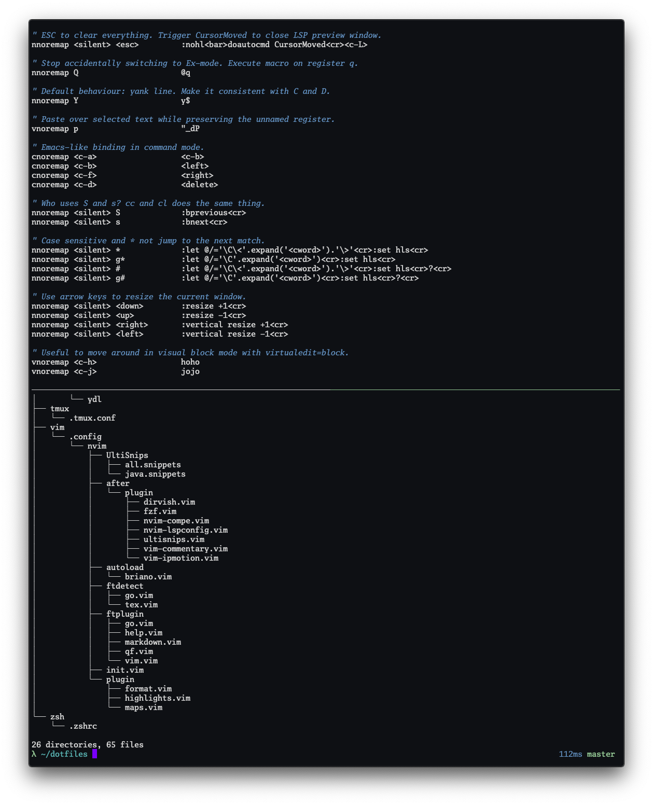

# Configuration

## Mac OS

### Install

    git clone https://github.com/bbriano/dotfiles
    cd dotfiles
    chmod +x install.sh
    ./install.sh

### iTerm2 options

- General > Window > Adjust window when changing font size -> Yes
- Profiles > Colors > Color Presets -> p-ocean
- Profiles > Text > Font -> Go Mono
- Profiles > Window > Style -> No Title Bar
- Profiles > Terminal > Scrollback lines -> 0
- Advanced > Windows > Terminal windows resize smoothly -> Yes
- Advanced > Terminal > Prevent accidental drags -> Yes
