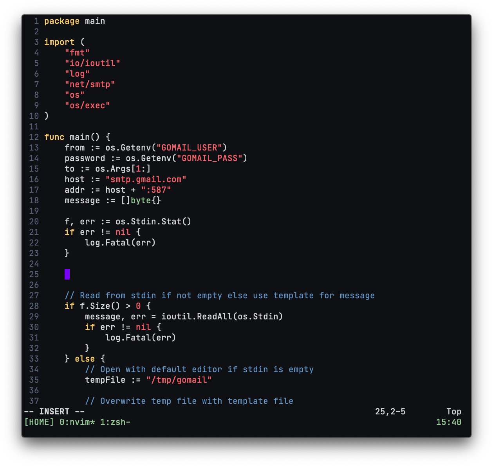

# Configuration



## Mac OS

### Clone this repo

```bash
git clone git@github.com:bbriano/dotfiles ~/n/dotfiles
```

### Create symbolic links

```bash
mkdir -p ~/.config/nvim
ln -sf nvim ~/.config/nvim
ln -sf prettierrc.json ~/.prettierrc
ln -sf tmux.conf ~/.tmux.conf
ln -sf zshrc ~/.zshrc
```

### Change key repeat variable

```shell
defaults write -g InitialKeyRepeat -int 15  # normal minimum is 15 (225 ms)
defaults write -g KeyRepeat -int 1          # normal minimum is 2 (30 ms)
```

### Homebrew

```bash
# install homebrew
/bin/bash -c "\$(curl -fsSL https://raw.githubusercontent.com/Homebrew/install/master/install.sh)"

# install brew formulas
for formula in $(cat brew/leaves) do
    brew install "$formula"
done

# install brew casks
for cask in $(cat brew/casks) do
    brew install "$cask"
done
```

### Moom

```bash
defaults import com.manytricks.Moom Moom.plist
```

### iTerm2

```
General > Window > Adjust window when changing font size -> Yes
Profiles > Colors > Color Presets -> p-ocean
Profiles > Text > Font -> JetBrains Mono
Profiles > Window > Style -> No Title Bar
Advanced > Windows > Terminal windows resize smoothly -> Yes
```
